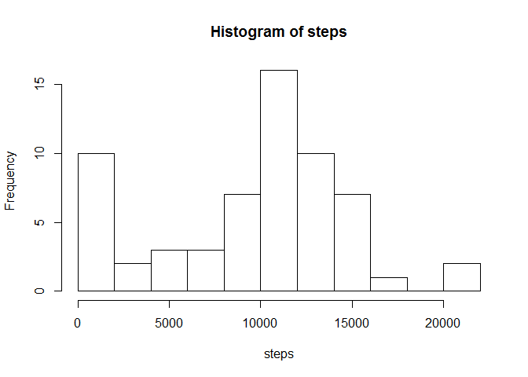
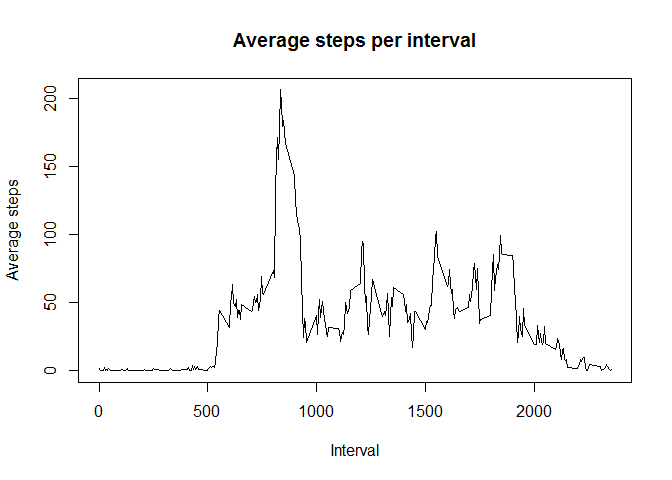
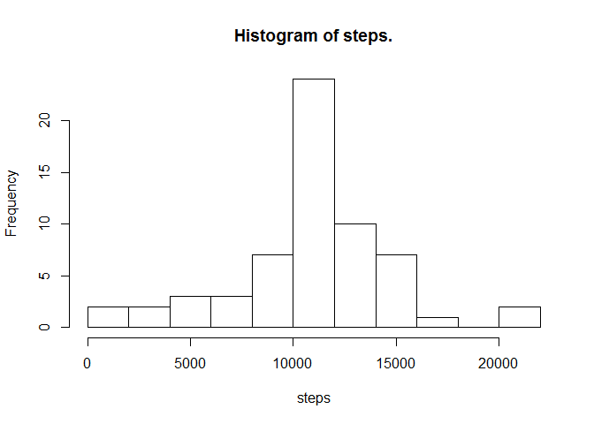
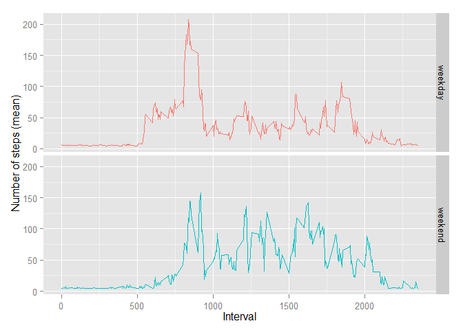

# Reproducible Research: Peer Assessment 1


## Loading and preprocessing the data


```r
library(ggplot2)
library(plyr)
unzip("activity.zip")
activity <- read.csv("activity.csv")
activity <- transform(activity, date= as.Date(date))
activity$interval.f <- factor(rep(seq(0,55,5), length(activity$interval)/12))
```

## What is mean total number of steps taken per day?


```r
total_steps_per_day <- aggregate(activity$steps, by = list(activity$date), FUN = sum, na.rm = TRUE)

hist(total_steps_per_day[, 2], xlab = "steps", breaks = 10, main = "Histogram of steps")
```

 


```r
mean_steps_per_day <- mean(total_steps_per_day[, 2], na.rm=T)
median_steps_per_day <- median(total_steps_per_day[, 2], na.rm = T)
```

The rounded mean was 9354 of steps taken per day.  
The median was 10395 of steps taken per day.  

## What is the average daily activity pattern?


```r
av_num_steps_allDays <- tapply(activity$steps,activity$interval,mean,na.rm=T)

with(activity,
     plot(
          rownames(av_num_steps_allDays),av_num_steps_allDays,type="l",
          xlab="Interval", ylab = "Average steps", 
          main="Average steps per interval"
          )
     )
```

 


```r
maxinterval <- names(which.max(av_num_steps_allDays))
```
The 835 interval contains the maximum number of steps.  

## Imputing missing values
Number of rows with NA.  

```r
sum(!complete.cases(activity$steps))
```

```
## [1] 2304
```

We have a lot of missing numbers, so lets replace all the NA with mean of steps in each inteval and create a new data frame.  

```r
activity_data <- activity
activity_data[is.na(activity_data$steps),"steps"] <- tapply(
        activity_data$steps,
        activity_data$interval.f,mean,
        na.rm=T)[ activity_data[is.na(activity_data),"interval.f"] ]
```
Make a new histogram with the new data frame.  

```r
total_steps_per_day <- aggregate(activity_data$steps, by = list(activity_data$date), FUN = sum, na.rm = TRUE)
hist(total_steps_per_day[, 2], xlab = "steps", breaks = 10, main = "Histogram of steps.")
```

 


```r
mean_steps_per_day <- mean(total_steps_per_day[, 2], na.rm=T)
median_steps_per_day <- median(total_steps_per_day[, 2], na.rm = T)
```

The rounded mean was 10766 of steps taken per day.  
The median was 10766 of steps taken per day.

## Are there differences in activity patterns between weekdays and weekends?


```r
activity_data <- transform(activity_data, weekday = weekdays(as.Date(date)))
# Due to locale i use Swe weekdays.
activity_data <- transform(activity_data, weekday.factor = as.factor(ifelse(weekday %in% c("lördag", "söndag"), "weekend", "weekday")))

data <- ddply(activity_data, .(interval, weekday.factor), summarise, 
       mean.number.of.steps = mean(steps, na.rm = TRUE))

ggplot(data = data, 
       aes(x = interval, y = mean.number.of.steps, col = weekday.factor)) + 
        geom_line() + 
        xlab("Interval") +
        facet_grid(weekday.factor ~ .) + 
        theme(legend.position = "none") + 
        ylab("Number of steps (mean)") 
```

 
